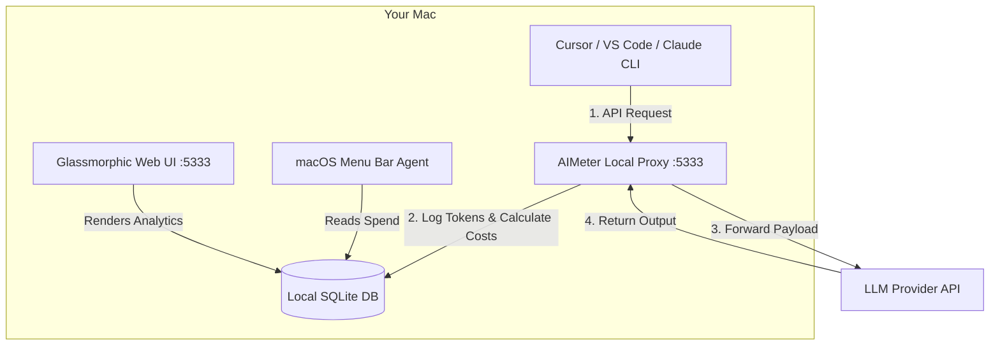

<p align="center">
  
</p>

<h1 align="center">AIMeter</h1>

<p align="center">
  <strong>The ultra-fast, local-first LLM API cost & token tracker for macOS.</strong><br>
  <em>Monitor, budget, and optimize your developer AI expenses with zero latency.</em>
</p>

<p align="center">
  <a href="https://github.com/smriti-memcore/aimeter/releases"></a>
  <a href="https://github.com/smriti-memcore/aimeter/blob/main/LICENSE"></a>
  
  
  
</p>

<p align="center">
  
</p>

---

**AIMeter** is a native macOS status bar widget and local API proxy designed to give developers total visibility into their AI API spend. It catches token metrics at the source with zero network overhead, keeping your credentials, prompts, and cost logs completely local.

Developed by [Smriti-Memcore](https://github.com/smriti-memcore).

## Table of Contents
- [Why AIMeter?](#why-aimeter)
- [How It Works](#how-it-works)
- [Key Features](#key-features)
- [Quick Start](#quick-start)
  - [Option 1: DMG Installer (Recommended)](#option-1-dmg-installer-recommended)
  - [Option 2: Homebrew](#option-2-homebrew)
- [Routing API Spend (Integrations)](#routing-api-spend-integrations)
  - [Global Shell Config](#global-shell-config)
  - [Cursor / VS Code Config](#cursor--vs-code-config)
  - [Python / Node.js SDKs](#python--node-js-sdks)
- [Dashboard & Analytics](#dashboard--analytics)
- [Architecture & File Footprint](#architecture--file-footprint)
- [License](#license)

---

## Why AIMeter?

Building and coding with LLMs (via Cursor, Claude Code, custom agents, or terminal scripts) makes it easy to run up unexpected API bills. Existing loggers require sending your data to third-party dashboards or slow down your calls with complex tracing SDKs. 

AIMeter solves this by running as a **lightweight local proxy** on your Mac. It:
1. Intercepts local HTTP traffic to OpenAI, Anthropic, Gemini, and OpenRouter.
2. Extracts token metadata on the fly with **zero latency overhead**.
3. Displays your live daily spend in a gorgeous macOS status bar widget and a glassmorphic web dashboard.

---

## How It Works



---

## Key Features

*   **Status Bar Cost Indicator:** A native, lightweight Swift-compiled helper displaying your active daily dollar spend in the macOS menu bar.
*   **Zero-Dependency Local Proxy:** Runs on port `5333` and transparently handles streaming connections for OpenAI, Anthropic, Gemini, and OpenRouter.
*   **Claude Code Watcher:** A background thread that parses local Claude CLI logs (`~/.claude/projects/`) and syncs costs automatically.
*   **Premium Web Dashboard:** A glassmorphic web dashboard displaying:
    *   *Visual Budget Progress:* Circular progress ring that updates dynamically based on your set budget.
    *   *Weekly Spend Trend:* Sleek sparklines showing your 7-day cost trajectory.
    *   *Live Logs Feed:* Real-time, relative-time list of intercepted models, requests, and cost breakdowns.
    *   *Custom Price Configuration:* Adjustable settings panel to input custom model pricing overrides.

---

## Quick Start

### Option 1: DMG Installer (Recommended)

1. Download the latest **`AIMeter.dmg`** from the [Releases Page](https://github.com/smriti-memcore/aimeter/releases).
2. Open the DMG and drag **AIMeter.app** into your `/Applications` directory.
3. Open **AIMeter** from your Applications folder.
4. Click the status bar icon and choose **"Configure Shell & IDEs..."** to automatically inject tracking variables into your environment.

> [!NOTE]
> On the first run, macOS Gatekeeper may show a warning. Right-click the app in Finder and click **Open** to authorize it.

---

### Option 2: Homebrew

Install and run AIMeter via CLI:

```bash
# Tap the repository
brew tap smriti-memcore/aimeter

# Trust the tap (Required for Homebrew 6.0.0+)
brew trust smriti-memcore/aimeter

# Install the package
brew install aimeter

# Start the background proxy daemon
brew services start aimeter

# Setup environment & load menu bar agent
aimeter setup
```

To uninstall cleanly:
```bash
aimeter setup --undo
brew services stop aimeter
brew uninstall aimeter
brew untap smriti-memcore/aimeter
```

---

## Routing API Spend (Integrations)

To track usage, simply configure your tools to point to the local proxy URL: `http://127.0.0.1:5333`.

### Global Shell Config
Add these lines to your `~/.zshrc` or `~/.bashrc`:
```bash
export OPENAI_BASE_URL="http://127.0.0.1:5333/openai/v1"
export ANTHROPIC_BASE_URL="http://127.0.0.1:5333/anthropic"
```

### Cursor / VS Code Config
Go to **Settings > Models** and update the base URLs:
*   **OpenAI API Section:** Set Base URL to `http://127.0.0.1:5333/openai/v1`
*   **Anthropic API Section:** Set Base URL to `http://127.0.0.1:5333/anthropic`

### Python / Node.js SDKs
```python
from openai import OpenAI

client = OpenAI(
    base_url="http://127.0.0.1:5333/openai/v1",
    api_key="your-api-key"
)
```

---

## Dashboard & Analytics

Access the live dashboard at:
```text
http://127.0.0.1:5333/
```
Manage models, configure daily budgets, reset stats, or review individual request payloads in real time.

---

## Architecture & File Footprint

All application files are kept in your user directory:
*   **SQLite Database:** `~/.aimeter/usage.db` (Contains token counts, timestamps, and cost data)
*   **Pricing Cache:** `~/.aimeter/model_prices.json` (Local pricing registry)
*   **Diagnostic Logs:** `~/.aimeter/daemon.log` (Proxy daemon runtime logs)

---

## License

This project is licensed under the MIT License - see the [LICENSE](LICENSE) file for details.
